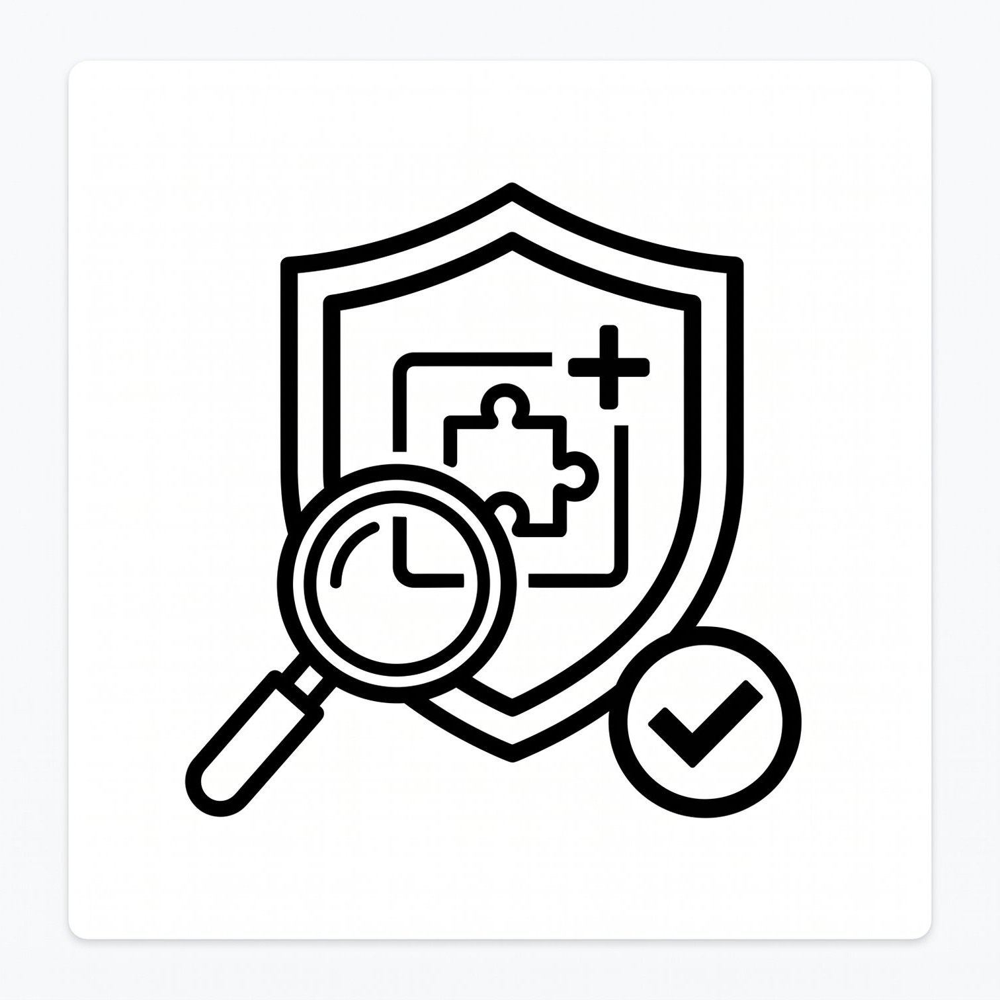
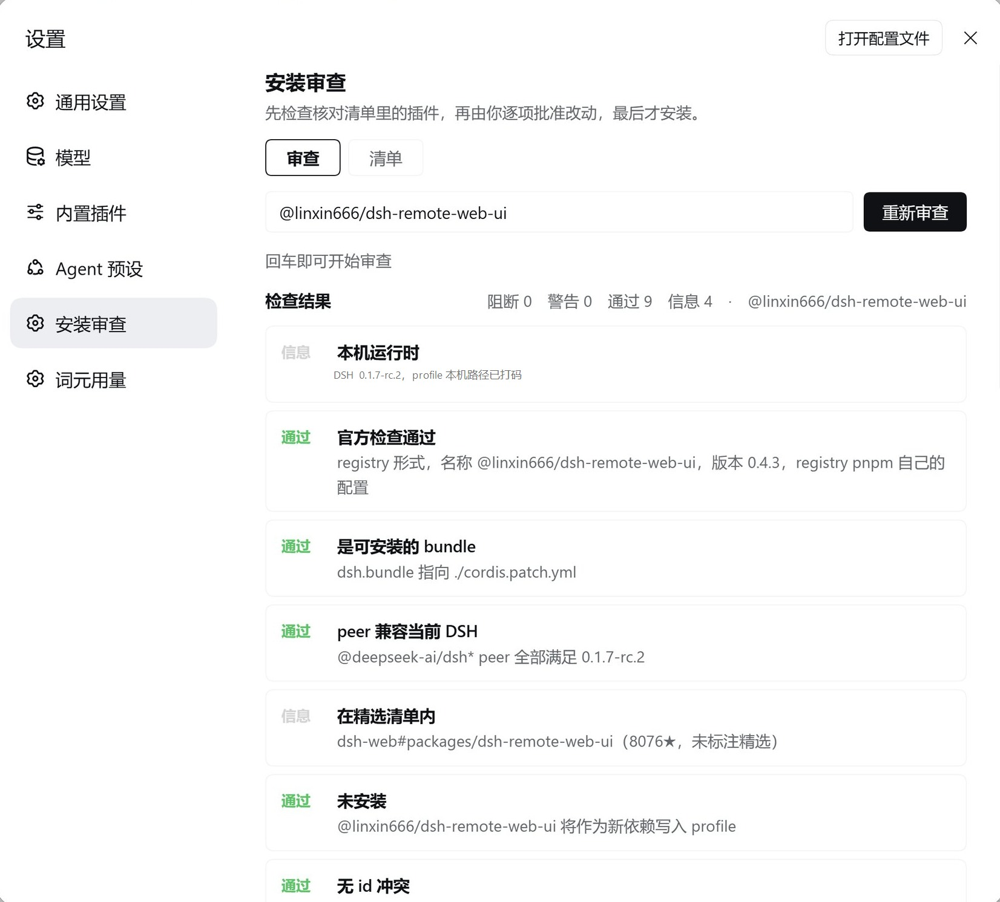
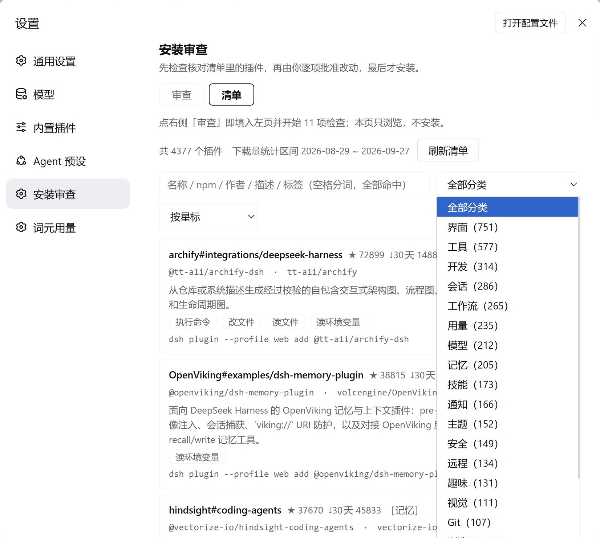
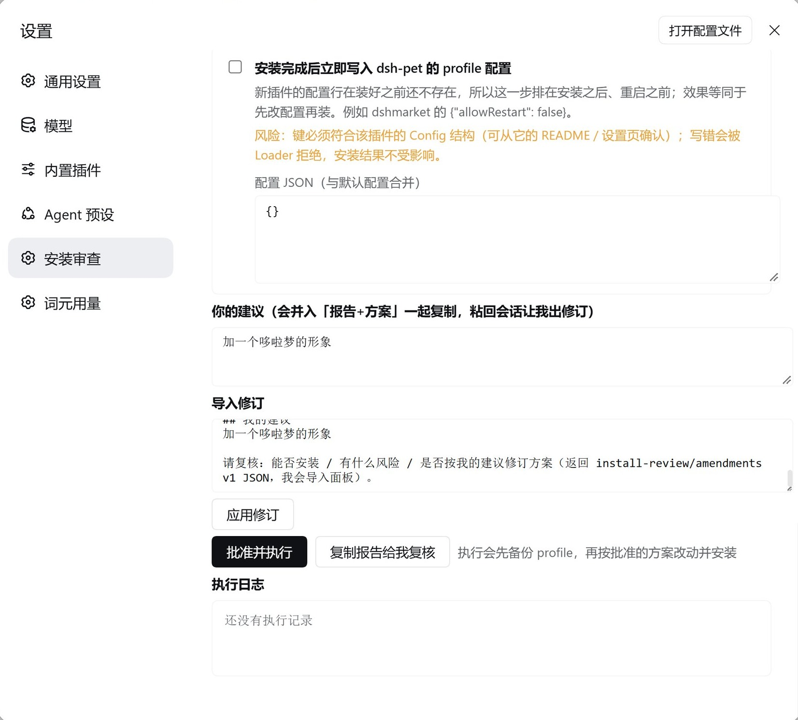

<div align="center">


# 插件装前审查 · Pre-install Review

**装之前，先看清它是谁。**

English · 简体中文 · [CHANGELOG](./CHANGELOG.md)


</div>

> **你装的每个插件，都攥着你的钥匙。** 它能读你全部会话、调你的模型、写你的 profile。
> 而"作者说无害"这句话——**每一个出过事的插件也都这么说**。

## 三个不舒服的事实

1. **清单收录 ≠ 安全背书。** 上游没标注能力时，这里写的是「上游未标注能力」，而不是替它编一个绿灯。
2. **"装完再说"是这个生态的默认姿势。** 没有备份、没有方案审批、没有装后核验——出事了你只能回滚整个 profile。
3. **全绿也不保证无害。** 但红灯你一定不想装：只要出现一项 **阻断**，正确的动作就是关掉这个页面。

**这个插件只做一件事：在你点「安装」之前，逼它把底牌亮出来——它是谁、能碰什么、要改哪些东西——然后由你逐项批准。**

## 界面

| 📋 审查报告（秒出，含能力与红线） |
| --- |
|  |

| 🗂 中文清单（4377 条快照，服务端搜索/分类/排序） |
| --- |
|  |

| ✅ 方案审批 · 你的建议 · 导入修订 |
| --- |
|  |

## 它检查什么（13~14 项，全部只读）

| 检查 | 说明 |
| --- | --- |
| 本机运行时 | DSH 版本与 profile（**路径自动打码**，截图可直接发给别人） |
| 官方检查 | `pluginManager.inspect`：`dsh.bundle` / `dsh.client` / `dsh.tool` / `dsh.page` / `dsh.configForm` |
| peer 兼容 | 镜像宿主解析语义（含 `includePrerelease`）——**1280 例与宿主 semver 全等** |
| 清单收录 | 名录、仓库、星标、30 天下载量（**不把仓库星标冒充包星标**） |
| 安装状态 | 已装 / 未装（认得 4 种 loader id 形态） |
| loader id 撞车 | 与本机全部 loader 行求交集——重复 id 会让宿主启动崩溃，这是用教训换来的检查 |
| 补丁覆盖行 | 目标 patch 的 override 行：目标存在吗？有没有被别的插件双重改写？（自审不自报） |
| 槽口核对 | 拿本机槽口目录逐个对：源码装读 `slot-catalog.ts`，**桌面/打包版读编译进 `app.asar` 的 `…/dsh-cordis-client-runner/lib/client.js`**——**跑不起来就给警告**，无法确认 ≠ 放行 |
| 安装期脚本 | `prepare` / `postinstall` 等 → 自动进入「批准并重试」流程 |
| 终端类表面 | 描述像 CLI 工具 → 警告「装进 web profile 可能不生效」 |
| engines | **两种写法都读**：`engines.dsh` 与 `dsh.engines.dsh`（只读其一会误报"未声明"） |
| 改宿主核心措辞 | 描述里出现改 DSH 本体的措辞 → 警告 |
| 能力与安全红线 | 清单标注的 10 类能力 + 红线句，**全部中译**；没标注就如实写"未标注" |

## 闭环：审查 → 方案 → 批准 → 改 → 装 → 核验

1. **审查**：输入 `npm 包名` / `owner/repo` / `github:owner/repo` / GitHub 链接 → 回车秒出报告
2. **方案**：只有**四类可执行改动**，勾选才会执行
   - **固定版本**（默认最新版，可改写版本号；写错安装会失败并回滚）
   - **构建脚本批准**（被 pnpm 拦截时，用 pnpm 报告的**准确包名**自动放行重试一次）
   - **装后写 profile 配置**（走 `configEditor` 官方通道：锁、校验、回滚；写错被 Loader 拒绝、安装结果不受影响）
   - **切换来源**（git 仓库 → npm 固定包名，避开装到一半仓库变更）
3. **你的建议**：想改方案？写进「你的建议」→「复制报告给我复核」粘给会话里的 AI → 它回一段**修订 JSON** → 粘进「导入修订」一键改勾选与参数（目标不匹配会直接拒收）
4. **执行**：先备份 `package.json` / `cordis.patch.yml` / `pnpm-workspace.yaml` / `cordis.yml` **四个文件** → 按批准的方案改动 → 安装 → **装后核验**（装上了吗？有没有重复 id？）
5. **构建脚本卡住**：面板就地弹出「批准 `<包名>` 的构建脚本并重试」——不卡死，也不越权（名字不在待决清单会被官方 `stale-approval` 拒绝）

## 边界（说清楚才可信）

- **不改第三方插件代码。** 只动来源、版本、构建批准、profile 配置这四类**属于你自己的配置**。
- **不动宿主源码。** 0 补丁，全走公开服务与 profile 文件；换代只换自己的文件名。
- **清单未标注能力 ≠ 安全。** 我们显示事实，不替上游背书。
- **这是装前体检，不是代码审计。** 它回答"能不能装、装了会碰什么"，不回答"里面有没有后门"。

## 安装

```sh
dsh plugin --profile web add github:GIN0076/dsh-install-review
```

- 要求：DeepSeek Harness **0.2.0-rc.2**（实测版本）+ web profile 或**桌面版**
- **零运行时依赖**、无构建步骤、无 postinstall
- 把 `@local/dsh-install-review` 加入 profile 的 `dsh.profile.bundles`，并在 `cordis.patch.yml` 加入它的 insert 行；只执行上面的 `add` 命令只会把仓库放进 `node_modules`，**不会挂载界面**
- 装完重启 `dsh web`，再**硬刷新**（Ctrl+Shift+R）→ 设置 → **插件装前审查**

**桌面版（打包 App，实测 0.2.0-rc.2）**：设置 → 插件 → **添加插件**，填本地目录路径（或插件管理工具 `install_bundle` 指向目录）；
装完重启 DeepSeek Harness 即可。桌面版有两处和浏览器直连不同，v1.1.0 都已适配：
① 运行时在 `resources/app.asar` 内、**没有 `src/` 源码树** → 槽口核对改读**编译版目录**
（`…/dsh-cordis-client-runner/lib/client.js`）；
② 窗口 origin 是 `dsh-app://app`，其协议处理器转发前会**删掉 `Origin` / `Sec-Fetch-Site` / `Cookie`**
再注入 Host 自己的会话 cookie → 面板请求不再自比 Origin，而是问宿主自己的
`connection.requestRejection`（与官方 `@deepseek-ai/dsh-host-open-in-app` 同一条通道；无 cookie → 401，
跨站 Origin → 403，并在响应里回带 `hint` + 看到的头部摘要）。Host 半因此换代到 `host-v8.js`。

> 不想走 git？把仓库拷到本地，用插件管理页的 `install_bundle` 指向目录，再完成同样的两处 profile 配置，效果完全一样。

## 卸载

设置 → 插件 → 移除，或插件管理页 `remove_bundle`。**卸载不会删你的备份**——每次执行前的备份写在 `<profile>/install-review-backup`（行 config 的 `backupDir` 可以改位置）。

## 自检

```sh
node semver-selftest.mjs          # 1280 例，与宿主 semver 全等（找不到宿主 semver 时标 SKIP）
node catalog-view-selftest.mjs    # 分类/能力/红线/投影
node patch-audit-selftest.mjs     # override 行解析与判定
node audit-selftest.mjs           # 解析 / peer / engines 双写法 / 端到端
node runner-selftest.mjs          # 备份 / 配置 / approvedBuilds / stale-approval
node host-selftest.mjs            # 路由与同源围栏
node client-selftest.mjs          # 修订导入闭环（有 react-dom 时额外做 SSR 渲染）
```

**七套自测，零测试框架、零依赖。** 端到端两套会读取真实外网清单：当被测包声明的 peer 不兼容当前 DSH 时，阻断是预期结果，不应把“全绿”当作安装许可。

> 自测自己找宿主依赖（`selftest-host.mjs`：源码树 / 本目录 / 打包运行时依次探测），**不再硬编码任何安装路径**。
> 想在桌面版上跑出真正的 1280 例 semver 比对：`$env:ELECTRON_RUN_AS_NODE=1; & "…\DeepSeek Harness.exe" semver-selftest.mjs`
> ——它会用 `app.asar` 里的 semver。找不到 node-semver / react-dom 时那一段标 `SKIP`（不是 FAIL）；
> 可用 `DSH_SELFTEST_SEMVER` / `DSH_SELFTEST_REACT` / `DSH_SELFTEST_REACT_DOM` 指定具体文件。
> 测试夹具里的用户名是假的（`localtester`），用来验证「报告里的本机路径一定被打码」。

## 免责声明

本工具在安装前检查**可安装性与影响面**，任何自动化检查都不能替代你对插件来源的判断；清单数据为上游快照（4377 条 / 下载量区间见页面标注），以抓取时为准。

## License

[MIT](./LICENSE) © 2026 GIN0076
